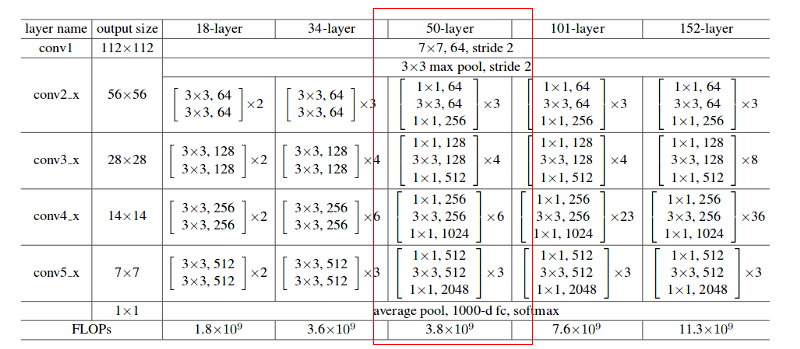
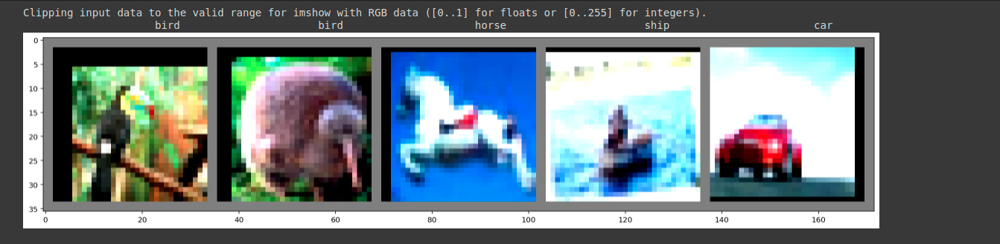
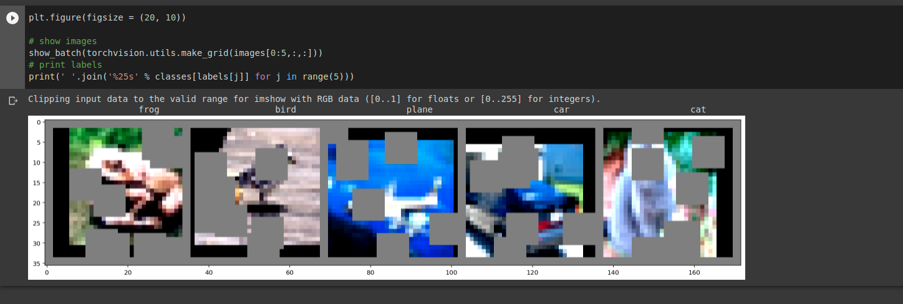
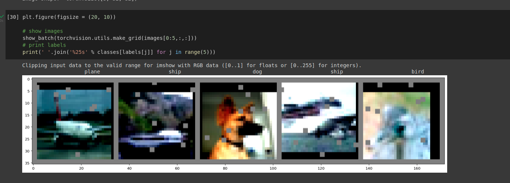
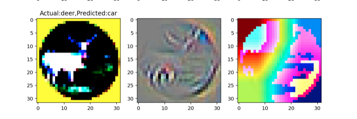

# Assignment_cifar10_resnet

### 1. Write a custom ResNet architecture for CIFAR10. (Incorporate Atleast two resnet blocks, Initial conv block and final fully connected/Global avg pooling layer plus any number of downscale/conv layers you might want to include, 3x3 convolutions and <5 million params)

For the purpose of this assignment, I started with implementation of a ResNet-50 architecture referenced from the following [paper](https://arxiv.org/abs/1512.03385). However the total number of trainable parameters in the architecture was 23, 555, 082 ( > than 5 million parameters).  

Next, I customized the ResNet50 architecture, by removing conv5_x layer, and reducing (from [3, 4, 6, 3]) the number of times each residual block is called by [3, 3, 3]. All other layers in the model remained the same. This customization reduced the the number of trainable parameters to 4,931,850 (achieving less than 5 million parameters). The accuracy of the model on test images was **86.55 %**.  

- My batch_size is 64, to improve the model I would prefer to increase the batch size,  
- I have played around with maximum learning rate (in the implemented pipeline I have tried 0.005, 0.025, 0.01 max_lr parameters) in one cycle learning rate policy. However this parameter didnt make a major difference in accuracy,   
- To improve the model I would like to dwell deeper into ResNet and try implementation of ResNet9 or reduce the expansion to from 4 to see if it affects the accuracy.  

For initial testing, I also implemented ResNet18 architecture on CIFAR10 dataset, where I got an accuracy of 92.0 % after 25 epochs. However the number of trainable parameters for this model was 11 million.

### 2. Use One Cycle Learning rate Policy and determine max learning rate to use.
Implemented one cycle learning rate policy based on [pytorch scheduler documentation](https://pytorch.org/docs/stable/generated/torch.optim.lr_scheduler.OneCycleLR.html#torch.optim.lr_scheduler.OneCycleLR).

### 3. Uses transform -RandomCrop 32, 32 (after padding of 4),  FlipLR, Followed by CutOut(8, 8)
I implemented the following transforms: Random crop with padding, RandomHorizontalFlip (similar to fliplr) and Normalization. Figure below displays 5 images of the dataset after applying the transforms. 

I tried implementation of cutout(8,8). However the images were highly distorted which I believed would interfere with the performance of the model. Hence I skipped implementation of cutout transform.

Following are the results of cutout(8, 2),

### 4. Target test accuracy 90% within 25 epochs
The accuracy of the custom ResNet model on test images is **86.55 %** after 25 epochs. 

### 5. Gradcam to find heatmaps for 10 incorrect labelled images.
Gradcam on a missclassified image

