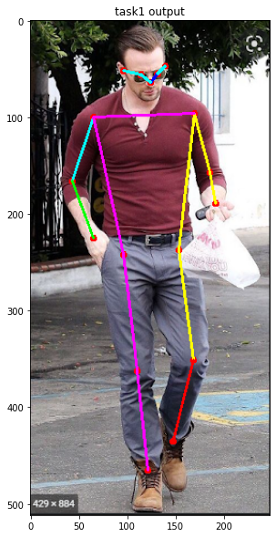

# Task 1
Task  1.1 The task  is to get all the landmarks on the body from the image and save the image as result [image format/ .jpg/.png/.jpeg format]. 
|Output Image|
|:------------:|
||

# Task 2

|Output pose estimation video|
|:------------:|
||
|[Youtube Link](https://youtu.be/BZA1jUqT58Q)|
# Task 3
