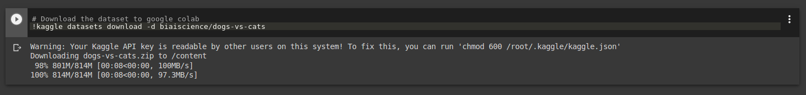

This section contains project implementations in Google Colab based on concepts taught in Lesson 2: **Deep learning with PyTorch** of Udacity's Secure and Private AI course.
# Brief overview
* **fashionMnist.ipynb** - I have implemented Lenet architecture to train and test a classifier on Fashion MNIST dataset. The code saves checkpoints on each epochs, and the classifier is tested on model saved at interim checkpoint. Also, how to continue training from the last checkpoint is implemented in this code.

* **transferLearningDatasetGit.ipynb** - Based on course notes I have implemented transfer learning on **densenet121** model. This is a pretrained model (trained for 100 classes) available in **torchvision_models**. Using transfer learning we re-purposed this model to act as a 2 class (cat vs dog) classifier. The dataset is imported within the Colab enviornment using github.

* **transferLearningKaggle.ipynb** - As mentioned, I have implemented transfer learning on **densenet 121** to build a cat vs dog classifier. The dataset is imported with the Colab enviorment using Kaggle.

# Accessing datasets in Colab via Kaggle
To generate Kaggle API key please review Ans1 of this *[post](https://stackoverflow.com/questions/49310470/using-kaggle-datasets-in-google-colab).

## Listing/ searching kaggle datasets in google Colab
- To list the current hosted datasets: Type `!kaggle datasets list` in your colab code cell.

- To search for a particular dataset: Type `!kaggle datasets list -s Dogs-vs.-Cats ` in your colab code cell.

- Current kaggle competitions list can be displayed by typing `!kaggle competitions list` in your colab code cell.

### Download the listed dataset in Colab
Type `!kaggle datasets download -d biaiscience/dogs-vs-cats ` in code cell. Replace **biaiscience/dogs-vs-cats** with your desired dataset.

### Downloading (in Colab dataset)from kaggle web pages
Go to the data page of your desired dataset on kaggle website.

Search for this bar between API and Dataset,

Copy the command to clipboard.

And paste it in your colab cell to begin downloading the dataset in colab enviornment.

